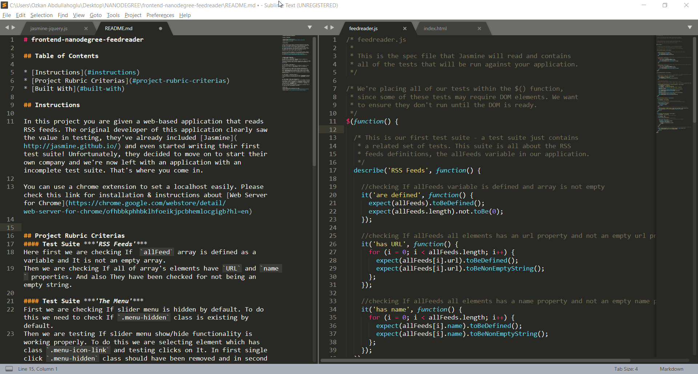

# frontend-nanodegree-feedreader

## Table of Contents

* [Instructions](#instructions)
* [Project Rubric Criterias](#project-rubric-criterias)
* [Built With](#built-with)

## Instructions

In this project you are given a web-based application that reads RSS feeds. The original developer of this application clearly saw the value in testing, they've already included [Jasmine](http://jasmine.github.io/) and even started writing their first test suite! Unfortunately, they decided to move on to start their own company and we're now left with an application with an incomplete test suite. That's where you come in.

You can use a chrome extension to set a localhost easily. You should run [index.html](https://ozkanabdullahoglu.github.io/frontend-nanodegree-feedreader/), to use the app. Please check this link for installation & instructions about [Web Server for Chrome](https://chrome.google.com/webstore/detail/web-server-for-chrome/ofhbbkphhbklhfoeikjpcbhemlocgigb?hl=en)

  

## Project Rubric Criterias
#### Test Suite ***'RSS Feeds'***
Here first we are checking If  `allFeed` array is defined as a variable and It is not an empty array.
Then we are checking If all of array's elements have `URL` and `name` properties. And also They have been checked for not being an empty string.

#### Test Suite ***'The Menu'*** 
First we are checking If slider menu is hidden by default. To do this we need to check If `.menu-hidden` class is existing by default.
Then we are testing If slider menu show/hide functionality is working properly. To do this we are selecting element which has class `.menu-icon-link` and testing clicks on It. In first single click `.menu-hidden` class should have been removed and in second single click It should have been re-implemented to achieve a proper show/hide action.

#### Test Suite ***'Initial Entries'*** 
We are checking If we get any feed entry when `loadFeed()` function is called. Because of asynchronousity we use `beforeEach` function first.

#### Test Suite ***'New Feed Selection'***
When a new feed selected all contents have to be changed and unique to eachother. To test this properly, we create and array to collect feeds content which is `feedHtml`. In `beforeEach` function we  call `loadFeed()` twice and push them into the `feedHtml` array. 
Then we are comparing contents incremently to eachother and we are expecting them `not.toEqual` eachother. 

## Built With
In this project below extensions are used;

* [Jasmine-Matchers](https://github.com/JamieMason/Jasmine-Matchers)
* [Jasmine-Jquery](https://github.com/velesin/jasmine-jquery) 
